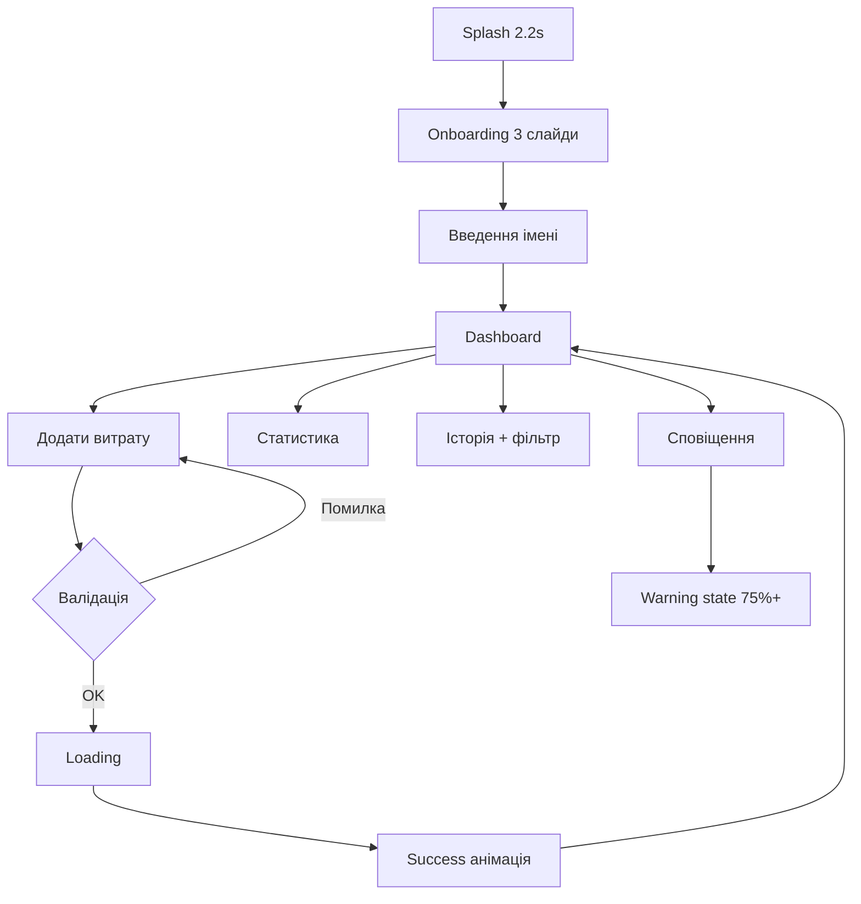

# SpendWise — Мобільний додаток для контролю витрат студентів

Інтерактивний UI/UX прототип (React + Tailwind CSS + Framer Motion + Recharts).

## Запуск

### Варіант 1 — подвійний клік (Windows)

Запустіть файл **`start.bat`** у папці проєкту.

### Варіант 2 — термінал

```bash
npm install
npm run dev
```

Відкрийте **http://localhost:5173** у браузері.

### Якщо не запускається

| Симптом | Причина | Рішення |
|--------|---------|---------|
| `'npm' is not recognized` | Node.js не встановлений | [nodejs.org](https://nodejs.org) → LTS, або `winget install OpenJS.NodeJS.LTS` |
| Команда не знаходиться після установки | Старий PATH у терміналі | **Закрийте й відкрийте** Cursor / PowerShell |
| Порожня сторінка | Не виконано `npm install` | `npm install` у папці проєкту |
| Порт зайнятий | 5173 вже використовується | Зупиніть інший `npm run dev` або змініть порт у `vite.config.js` |

> Cursor має вбудований `node`, але **без npm** — для цього проєкту потрібен повноцінний Node.js з сайту.

---

## 1. UX-логіка

| Принцип | Реалізація |
|--------|------------|
| **Один головний фокус** | Dashboard показує баланс і прогрес бюджету одразу після входу |
| **Мінімум кроків** | Додавання витрати — один екран, 4 поля, одна кнопка підтвердження |
| **Миттєвий feedback** | Loading → Success overlay → Toast → оновлення графіків |
| **Превенція** | Попередження при 75%+ бюджету; червоний банер при перевищенні |
| **Контекстні поради** | Картка з порадою на dashboard; блок рекомендацій у статистиці |
| **Фільтрація без втрати контексту** | Горизонтальні chips у історії; стан «порожньо» якщо немає записів |

Користувач завжди бачить: **скільки залишилось**, **скільки витрачено**, **куди пішли гроші**.

---

## 2. User flow



**Основний сценарій (з завдання):**
1. Відкриття → Splash → Onboarding → Dashboard  
2. «Додати витрату» → форма (сума, категорія, опис, дата)  
3. Підтвердження → анімація успіху → оновлення статистики та графіка  
4. Перегляд історії, фільтр категорій, місячна статистика, сповіщення про бюджет  

---

## 3. Self-review інтерфейсу

**Сильні сторони:**
- Dark fintech aesthetic, фіолетовий акцент, rounded cards  
- Чітка візуальна ієрархія: баланс → прогрес → графік → список  
- Мікроанімації (Framer Motion) не перевантажують UX  
- Мобільна рамка 390×844 імітує реальний пристрій  

**Що можна покращити в production:**
- Справжня автентифікація та синхронізація з бекендом  
- Налаштування бюджету та валюти  
- Swipe-to-delete у історії  
- Haptic feedback на iOS/Android  

---

## 4. Стани системи

| Стан | Де видно |
|------|----------|
| **idle** | Звичайна взаємодія |
| **loading** | Перехід між табами; відправка форми витрати |
| **success** | Overlay з галочкою після додавання витрати |
| **error** | Червоне повідомлення під формою (невалідна сума/опис) |
| **warning** | Банер на dashboard; блок на екрані сповіщень при 75%+ бюджету |
| **empty** | «Витрат у цій категорії немає» в історії |
| **splash** | Автоперехід через 2.2 с |

---

## 5. Hierarchy компонентів

```
App
├── AppProvider (context)
└── AppContent
    ├── MobileFrame
    │   ├── [Screen]
    │   │   ├── SplashScreen
    │   │   ├── OnboardingScreen → Button
    │   │   ├── DashboardScreen
    │   │   │   ├── Card, ProgressBar, WeeklyBarChart
    │   │   │   ├── CategoryIcon, Button
    │   │   ├── AddExpenseScreen
    │   │   │   ├── Form + CategoryIcon grid
    │   │   │   ├── LoadingOverlay, SuccessOverlay
    │   │   ├── StatisticsScreen → CategoryPieChart
    │   │   ├── HistoryScreen → FilterChip
    │   │   └── NotificationsScreen
    │   └── BottomNav (dashboard | statistics | history | notifications)
    ├── LoadingOverlay (навігація)
    └── Toast
```

**UI primitives:** `Button`, `Card`, `ProgressBar`, `Toast`, `CategoryIcon`  
**Charts:** `WeeklyBarChart`, `CategoryPieChart`  
**Data:** `mockData.js` + `AppContext`  

---

## 6. Опис для презентації лабораторної

**Назва проєкту:** SpendWise — мобільний прототип контролю витрат студентів.

**Мета:** допомогти студентам відстежувати витрати, аналізувати бюджет за категоріями (їжа, транспорт, навчання, розваги, підписки) та отримувати рекомендації щодо економії.

**Реалізовано 7 екранів:** Splash, Onboarding/Login, Dashboard, Додавання витрати, Статистика, Історія, Сповіщення (warning).

**Стек:** React 18, Vite, Tailwind CSS, Framer Motion, Recharts, mock-дані.

**Демонстрація:** запустити `npm run dev`, пройти onboarding, додати витрату — побачити оновлення progress bar, bar chart і pie chart, перевірити фільтр в історії та warning у сповіщеннях.

---

## Структура проєкту

```
src/
├── App.jsx
├── main.jsx
├── index.css
├── context/AppContext.jsx
├── data/mockData.js
├── components/
│   ├── ui/
│   ├── layout/
│   └── charts/
└── screens/
```

## Категорії витрат

- Їжа  
- Транспорт  
- Навчання  
- Розваги  
- Підписки  

Місячний бюджет (mock): **₴8 000**
